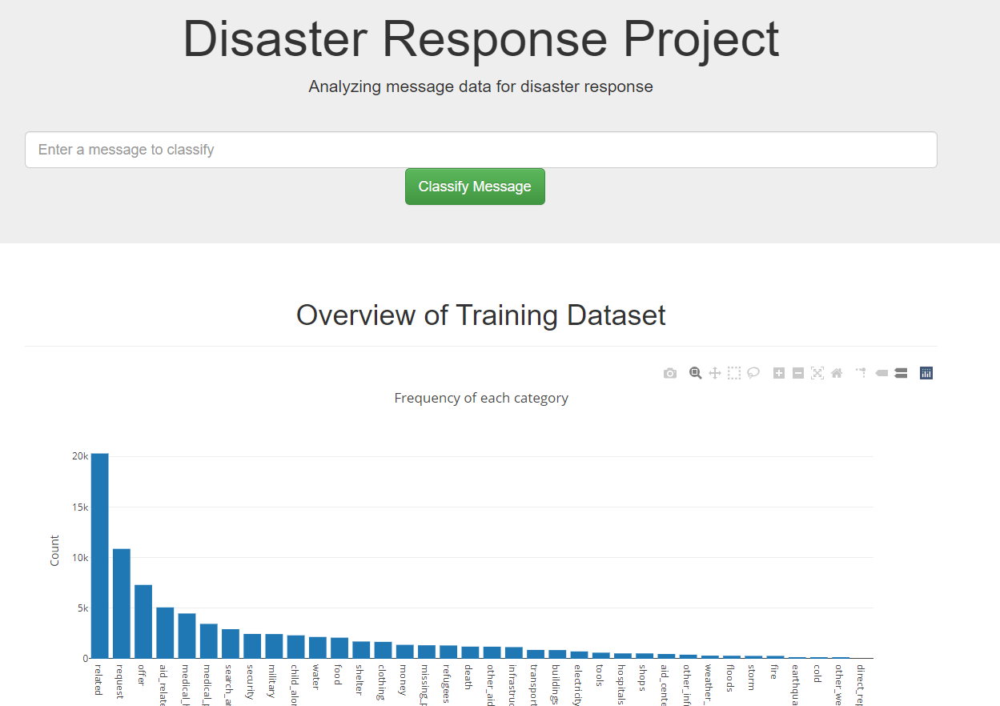

# Disaster Response Pipeline Project

### Instructions:
1. Run the following command to install the required packages.
    ```python
    pip install -r requirement.txt
    ```
   I highly recommend you to use a virtual environment in order to separate it from your python environment. For example,
    `python venv -m project3`
   
2. Run the following commands in the project's root directory to set up your database and model. **You can skip this step as I already have set up all required data and model.**

    - To run ETL pipeline that cleans data and stores in database
        `python data/process_data.py data/disaster_messages.csv data/disaster_categories.csv data/project.db`
    - To run ML pipeline that trains classifier and saves
        `python models/train_classifier.py data/project.db models/classifier.pkl`

3. Run the following command in the app's directory to run your web app.
    `python app/run.py`

4. Go to http://0.0.0.0:3001/ or http://localhost:3001/


